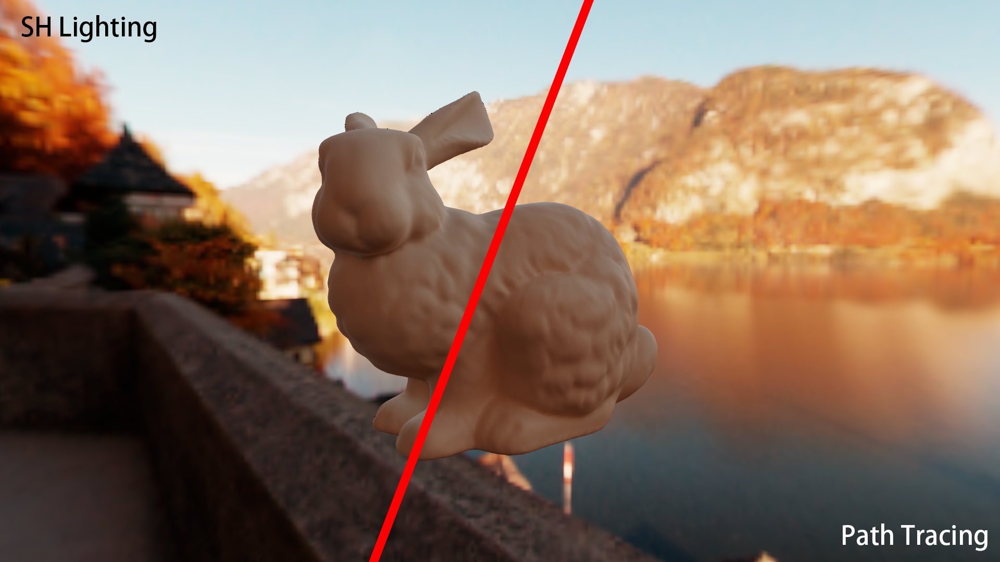

# Falcor 7.0 - Pixel-Space Spherical Harmonics Lighting

This is a repository implementing a render pass of pixel-space spherical lighting in Falcor 7.0. The above picture compares the rendering results of spherical harmonics lighting and path tracing, where there is a little difference of the rendered color on the bunny due to the max degrees of spherical harmonics lighting (which is 4 for this image). 

And "Pixel-Space" mean that the transfer coefficients are computed for each shaded pixel instead of for each vertex, which is easier to implement and can be used to generate pixel-precision dataset for more use. (e.g. network training...)

To achieve the above result, all we need is to implement a `SHLighting` renderpass, which is in `Falcor/Source/RenderPasses/SHLighting`, and I will introduce the key steps implementing the pass below.


## Create a renderpass

Type the following command in the terminal to create a renderpass named `SHLighting`:

```bash
.\tools\make_new_render_pass.bat SHLighting
```

Now a new renderpass named `SHLighting` is added in `Falcor/Source/RenderPasses`, just copy my code in `SHLighting` into the folder and recompile Falcor to make it work.


## Create a python script for loading the SHLighting RenderGraph

After successfully compiling Falcor, we need to launch `Moguai.exe` to load the SHLighting rendergraph from a python script, which is in `Falcor/scripts/SHLighting.py`. This script is easy to understand since it is just like `Falcor/scripts/MinimalPathTracer.py`.


## Code explained for SHLighting

The key code for SHLighting is in the shader file `Falcor/Source/RenderPasses/SHLighting/Tracer.rt.slang`, line `389-424`.

To be short, the key process of SHLighting is to sample N brdf_weight and project them to spherical harmonic basis functions to formulate the transfer coefficients and also sample N radiance values from the environment map or other light sources to formulate the light coefficients.

```c++
// step 1: initialize a set of transfer coefficients
// 9 is hard-coded here, meaning that we use lmax=2, so (lmax + 1) * (lmax + 1) = 9
float3 transfer[9];
for (uint32_t i = 0; i < 9; i++) {
    transfer[i] = float3(0.f);
}

// step 2: sample N brdf_weight and project them to SH basis functions to get transfer coefficients
for (uint32_t i = 0; i < gParams.raySamples; i++)
{
    BSDFSample bsdfSample;
    mi.sample(sd, sg, bsdfSample, kUseImportanceSampling);
    
    float SHR[9];
    float SHG[9];
    float SHB[9];
    accumShProjection(bsdfSample.wo, bsdfSample.weight.x, SHR);
    accumShProjection(bsdfSample.wo, bsdfSample.weight.y, SHG);
    accumShProjection(bsdfSample.wo, bsdfSample.weight.z, SHB);
    for (uint32_t j = 0; j < 9; j++)
    {
        transfer[j] += float3(SHR[j], SHG[j], SHB[j]);
    }
}
for (uint32_t i = 0; i < 9; i++)
{
    transfer[i] /= gParams.raySamples;
}

// step 3: SHLighting. Multiply the transfer coefficients and light coefficients
// light coefficients are calculated the same way in GenProbe.cs.slang
LightCoefficients l = lightCoefficients[0];
for (uint32_t i = 0; i < 9; i++)
{
    outColor += l.lightCoefficients[i] * transfer[i];
}
```


## More to say

The availability of Falcor resources on open-source platforms like GitHub is quite limited. To address this gap, I plan to regularly update and provide tutorials on Falcor. This initiative is aimed at enabling graphics researchers to quickly engage with practical aspects and facilitate their research endeavors.

Feel free to ask me if you have any questions using Falcor. :)
